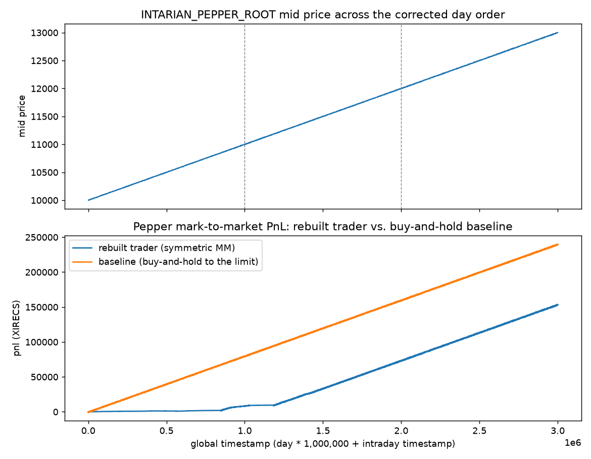
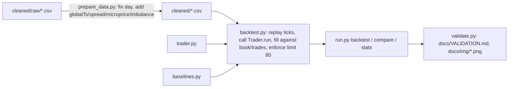

# OpporCode

[](https://github.com/vincal848/imc-prosperity-market-making/actions/workflows/tests.yml)

This project came out of IMC Prosperity 2026 Round 1, a two-product market-making
round (ASH_COATED_OSMIUM and INTARIAN_PEPPER_ROOT, position limit 80). Across
the round I wrote five versions of the trading bot, ending with TraderC1: an
Avellaneda-Stoikov-flavored market maker with an empirically fit half spread
and a vol-shock spread widener.

I have since rebuilt it: fixed a real pricing bug in the strategy (a
truncation-vs-rounding error in the fair-value clamp), fixed a reversed `day`
label in the cleaned data that made Pepper's trend look like three
disconnected sawtooths instead of one continuous line, and built a local
backtester so the strategy's actual numbers are honest rather than assumed.
****The headline finding is not flattering, and it got less flattering once the
comparison was made honest: on INTARIAN_PEPPER_ROOT a correct hold-to-the-limit
baseline earns 239,471 XIRECS over the round versus 10,398 for the symmetric
market maker (the earlier 26,955 baseline only ever held 9 units -- a bug).**
Nothing here beats hold-to-limit on Pepper: a null-calibrated regime switch
reaches 153,106 because it needs evidence before it commits, and it ties the
baseline only on day 2. On ASH_COATED_OSMIUM, a market maker re-tuned on day 0
under stressed fills beats the fixed-value baseline on both test days under
both fill models (but it is a mean-reversion bet: it loses badly on a
random-walk version of Ash, see Checks).


*Top: Pepper's mid price across all three days once the day labels are fixed -- one continuous
rise from 10,000 to 13,000, not the three-segment sawtooth in the original
`Background_and_Research/PepperGraph.png`. Bottom: the trend is strong enough that just buying
to the limit and holding beats the rebuilt market maker's PnL curve for the whole round.*

## At a glance

| | |
|---|---|
| **Methods** | Avellaneda-Stoikov-style inventory skew, empirical fill-rate-weighted half spread, vol-shock spread widening, short-window drift fair-value shift |
| **Inputs** | `cleaned/*.csv` -- 3 days x 10,000 ticks x 2 products of IMC Prosperity order book snapshots and trades |
| **Outputs** | `trader.py` (submission-ready), per-tick/per-day mark-to-market PnL |
| **Validation** | 37 pytest tests: pricing formulas, skew sign/clamp, state round-trip, position-limit compliance, backtester fill/limit invariants, day-ordering correctness |
| **Headline result** | Hold-to-limit (239,471) beats every Pepper strategy tried out of sample; the Ash MM re-tuned on day 0 under stressed fills beats its fixed-value baseline on both test days under both fill models, but is a mean-reversion bet |
| **Stack** | Python 3.13, stdlib only for `trader.py`; pandas/numpy/matplotlib for backtest/analysis |

## Results

Two backtester fixes changed the numbers: the trader now sees the *previous*
tick's trades while resting quotes fill against the *current* tick's, and the
buy-and-hold baseline now buys every tick until position 80 (it used to buy
once and end at 9 units). Each has a test that fails without it.

**Protocols.** [`docs/PROTOCOL.md`](docs/PROTOCOL.md) (19 variants) and
[`docs/PROTOCOL-2.md`](docs/PROTOCOL-2.md) (20 more: 6 Pepper regime-switch
variants, 14 Ash market-maker variants) were each committed before their
experiments: tune on **day 0 only**, score days 1 and 2 once. **Total variants
tried: 39.** `python walkforward.py tune` reproduces the day-0 search and writes
`docs/tuned.json`; `python walkforward.py test` produces the tables below.
Stressed fills = passive fills at 50% of printed quantity, strictly-through
prints only; the Ash MM was tuned under them.

### Pepper (per-day PnL, XIRECS)

| strategy | fills | day 0 | day 1 | day 2 | total |
|---|---|---:|---:|---:|---:|
| hold-to-limit | either | 79,591 | 79,720 | 80,160 | 239,471 |
| regime switch, \|t\| > 3.7, no overlay (day-0 pick) | normal | 8,273 | 64,673 | 80,160 | 153,106 |
| regime switch (same) | stressed | 10,978.5 | 69,927.5 | 80,160 | 161,066 |
| original market maker (switch off) | normal | 3,020.5 | 4,105.5 | 3,272 | 10,398 |

Out of sample the switch loses day 1 by 15,047 and ties day 2 exactly. The
regime statistic is an expanding-window drift t-stat; the threshold 3.7 is the
99th percentile of its running maximum on a driftless random walk (a threshold
of 2 is hit by a random walk 40% of the time, so it was ineligible). The price of
a false-alarm rate of 1% is waiting ~15,000 ticks (into day 1) for Pepper's t-stat
to cross it.

**Hold-to-limit is the ceiling for a monotone drift under an 80-unit cap.**
Pepper rises ~2,993 points over the round (239,471 / 80). With position bounded
by 80, drift PnL is at most 80 x 2,993 = 239,440 whatever the strategy; every
tick spent below 80 forgoes 0.1 points/tick/unit (~0.1 x 80 = 8 per tick), and a
round trip against the spread (~12 points) only pays if the unit is re-bought
within ~120 ticks. The overlay variants (band 10) were worse on day 0. The only
thing a smarter strategy could add is knowing the regime earlier, which needs a
prior (hard-coding the symbol) or data we do not have. So the regime switch is
kept only to route Pepper to the +/-80 core and Ash to market making.

### Ash (per-day PnL, XIRECS)

| strategy | fills | day 0 | day 1 | day 2 | total |
|---|---|---:|---:|---:|---:|
| fixed-value MM (10000 +/- 2) | normal | 6,523 | 8,381 | 6,082 | 20,986 |
| original learned MM | normal | 8,018 | 8,356 | 7,802 | 24,176 |
| **re-tuned MM** (day-0 pick) | normal | 8,996 | 11,670 | 9,572 | 30,238 |
| fixed-value MM | stressed | 4,416 | 6,242 | 4,499 | 15,157 |
| original learned MM | stressed | 2,221.5 | 2,329.5 | 2,244 | 6,795 |
| **re-tuned MM** (day-0 pick) | stressed | 5,569.5 | 8,385.5 | 5,754 | 19,709 |

The day-0 pick (by stressed day-0 Ash PnL, coordinate descent): half spread 3
(not learned), inventory skew unchanged, fair value = mean of the last 500 mids
(anchor weight 1.0), take the book when it is 2 ticks through fair value, size
20. It beats the fixed-value baseline on both test days under **both** fill
models. The original learned MM did not survive the stressed model.

### Checks (`python checks.py`; tests in `tests/test_trader.py`)

| check | result |
|---|---|
| null: linearly detrended Pepper | Passes: position never exceeds 13. **Correction:** the first version of this check shifted the book but not the trades, which made the market maker run to -80 and was misreported as the trend mode engaging; the trades are now shifted too, and the old 0.5-threshold configuration also passes this null. |
| null: driftless random walk (5 seeded paths x 10,000 ticks) | The old 0.5 threshold engages; the 3.7 threshold never does. This is the test that fails with the old threshold. |
| placebo: Pepper mirrored | Goes to -80, earns 153,106 (symmetric), no blow-up; hold-to-limit loses 240,511. |
| fill stress | Pepper unchanged for hold-to-limit; see tables for the Ash MM. |
| null for the Ash MM: shuffled-increment random-walk Ash | **The re-tuned MM loses 211,673** (fixed-value baseline +22,141). Its edge is a bet that Ash mean-reverts; the regime switch only tests for drift, not for mean reversion. |

Caveats: one path per product, three days, 39 variants with the best chosen on a
single tuning day. Next hypothesis: a mean-reversion test (variance ratio) as the
second leg of the regime switch so the Ash MM stands down when Ash stops
reverting.

## How it works



`trader.py` is a single-file, stdlib-only Trader: per tick, per product, it
tracks a rolling fair value (last two-sided microprice), a decayed histogram
of `|trade price - fair value|` used to pick the half spread that maximizes
`fillRate(distance) * distance`, a short/long realized-vol ratio used to
detect and widen for vol shocks, and (Pepper only) a short-window drift used
to shift fair value and widen further. Inventory skew follows an
Avellaneda-Stoikov-style form, `position * sigma * sqrt(1 / (fillRate *
horizon))`, clamped to +/-4 ticks.

## Decisions

- Kept TraderC1's strategy intact rather than redesigning it -- the task was
  to rebuild and fix, not to re-invent the strategy. The one behavioral
  change (rounding vs. truncating the fair-value clamp) is narrow and tested.
- `prepare_data.py` treats the already-committed `cleaned/*.csv` as the
  frozen raw source (moved to `cleaned/raw/` via `git mv`) rather than trying
  to reconstruct whatever the original ingestion script read from IMC's raw
  per-day files, which no longer exist in this repo's history.
- The backtester's fill model is a documented simplification (crossing fills
  walk the visible book; passive fills cross against printed trades at our
  own price) since IMC's actual matching engine is not public. See
  `backtest.py`'s module docstring for the exact rules.
- Baselines are deliberately parameter-free: a fixed-value MM for mean-
  reverting Ash, hold-to-the-limit for trending Pepper. The point is to show
  whether the rebuilt strategy's complexity earns its keep against the
  simplest sane alternative for each market's character, not to find the
  single best possible trivial strategy.

## Quick start

```bash
python -m venv .venv
.venv/Scripts/activate    # .venv/bin/activate on Linux/macOS
pip install -r requirements-dev.txt

python prepare_data.py            # generate cleaned/ from cleaned/raw/ (required first; cleaned/*.csv is gitignored)
python run.py stats               # per-day price stats, shows the Pepper trend
python run.py backtest            # rebuilt trader, both products, all days
python run.py compare             # rebuilt trader vs. trivial baseline, both products
pytest tests -q                   # 37 tests
python walkforward.py tune        # all variants on day 0 (prints the variant count)
python walkforward.py test        # the day-0 picks on days 0-2, both fill models
python checks.py                  # null, placebo, fill-stress checks
python validate.py                # regenerate docs/VALIDATION.md and docs/img/*.png
```

## Repository guide

| Path | Contents |
|---|---|
| `trader.py` | The submission-ready bot (stdlib only) |
| `datamodel.py` | Minimal reimplementation of IMC's public `datamodel` interface |
| `backtest.py` | Deterministic local replay/fill engine |
| `baselines.py` | Trivial comparison traders used by `run.py compare` |
| `prepare_data.py` | Regenerates `cleaned/*.csv` from `cleaned/raw/*.csv`, fixing the day order |
| `run.py` | CLI: `backtest`, `stats`, `compare` |
| `validate.py` | Regenerates `docs/VALIDATION.md` and `docs/img/*.png` |
| `cleaned/raw/` | Frozen pre-fix `allPrices.csv`/`allTrades.csv` |
| `cleaned/` | Corrected prices/trades/analysis CSVs (generated by `prepare_data.py`, gitignored) |
| `walkforward.py`, `checks.py` | Day-0 tuning / out-of-sample scoring; null, placebo and fill-stress checks |
| `docs/PROTOCOL.md`, `docs/PROTOCOL-2.md`, `docs/tuned.json` | The evaluation protocols (declared before the experiments) and the day-0 picks |
| `legacy/` | The four superseded bots plus the original TraderC1.py, annotated |
| `Background_and_Research/` | Pre-rebuild exploratory plots (`AshGraph.png`, `PepperGraph.png`) |
| `docs/BACKGROUND.md` | Full writeup of the day-ordering bug and why it matters |
| `docs/VALIDATION.md` | Generated numbers (see `validate.py`) |
| `tests/` | pytest suite, sentence-named, no network |

## Future interests

- A mean-reversion test as the second leg of the regime switch (see Results).
- Round 2+ products and the actual IMC conversions/observations mechanics,
  which this round didn't exercise (`datamodel.py` includes
  `ConversionObservation` for forward compatibility but nothing here uses it).
- A proper event-driven backtester if IMC ever publishes order-level (not
  just top-3-level aggregated) book data, to drop the passive-fill
  assumption.

## Notes

- Data provenance: all CSVs under `cleaned/` originate from IMC Prosperity
  2026 Round 1's own data export for ASH_COATED_OSMIUM and
  INTARIAN_PEPPER_ROOT; `datamodel.py` mirrors IMC's own (unpublished as a
  package) interface closely enough that `trader.py` is submission-compatible,
  but is not IMC's code.
- `cleaned/*.csv` is derived and gitignored; only `cleaned/raw/` (the sole copy of the original export) is committed.
- Backtest timings are single-core on a Windows machine; a full `run.py
  backtest` (both products, 60,000 ticks total) runs in a few seconds, and
  `run.py compare` (double that, with a second trader) in well under a
  minute.
- The position-limit and fill-model assumptions in `backtest.py` are a
  simplification of IMC's real matching engine, which is not public; see its
  module docstring for the exact rules assumed.
