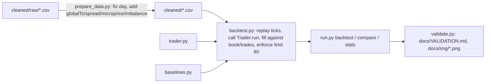

# OpporCode

[](https://github.com/vincal848/OpporCode/actions/workflows/tests.yml)

This project came out of IMC Prosperity 2026 Round 1, a two-product market-making
round (ASH_COATED_OSMIUM and INTARIAN_PEPPER_ROOT, position limit 80). Across
the round I wrote five versions of the trading bot, ending with TraderC1: an
Avellaneda-Stoikov-flavored market maker with an empirically fit half spread
and a vol-shock spread widener.

I have since rebuilt it: fixed a real pricing bug in the strategy (a
truncation-vs-rounding error in the fair-value clamp), fixed a reversed `day`
label in the cleaned data that made Pepper's trend look like three
disconnected sawtooths instead of one continuous line, and built a local
backtester so the strategy's actual numbers are honest rather than assumed.
**The headline finding is not flattering: on INTARIAN_PEPPER_ROOT, a trivial
buy-and-hold-to-the-limit baseline earns 26,955 XIRECS over the round versus
11,076 for the rebuilt symmetric market maker -- the product trends hard
enough, and consistently enough, that a bounded, mean-reversion-flavored
market maker leaves most of the money on the table.** The market maker does
win on ASH_COATED_OSMIUM, which actually mean-reverts (25,262 vs. 20,986 for
a fixed-fair-value baseline).


*Top: Pepper's mid price across all three days once the day labels are fixed -- one continuous
rise from 10,000 to 13,000, not the three-segment sawtooth in the original
`Background_and_Research/PepperGraph.png`. Bottom: the trend is strong enough that just buying
to the limit and holding beats the rebuilt market maker's PnL curve for the whole round.*

## At a glance

| | |
|---|---|
| **Methods** | Avellaneda-Stoikov-style inventory skew, empirical fill-rate-weighted half spread, vol-shock spread widening, short-window drift fair-value shift |
| **Inputs** | `cleaned/*.csv` -- 3 days x 10,000 ticks x 2 products of IMC Prosperity order book snapshots and trades |
| **Outputs** | `trader.py` (submission-ready), per-tick/per-day mark-to-market PnL |
| **Validation** | 29 pytest tests: pricing formulas, skew sign/clamp, state round-trip, position-limit compliance, backtester fill/limit invariants, day-ordering correctness |
| **Headline result** | Rebuilt MM beats a trivial baseline on mean-reverting Ash; a trivial buy-and-hold baseline beats the rebuilt MM on trending Pepper |
| **Stack** | Python 3.13, stdlib only for `trader.py`; pandas/numpy/matplotlib for backtest/analysis |

## Results

From `python run.py compare` (full 3-day replay, both products):

| product | strategy | final position | total pnl (XIRECS) |
|---|---|---:|---:|
| ASH_COATED_OSMIUM | rebuilt trader | 3 | 25,262.00 |
| ASH_COATED_OSMIUM | trivial fixed-value MM baseline | -80 | 20,986.00 |
| INTARIAN_PEPPER_ROOT | rebuilt trader | -4 | 11,076.00 |
| INTARIAN_PEPPER_ROOT | trivial buy-and-hold baseline | 9 | 26,955.00 |

Per-day PnL for the rebuilt trader (`python run.py backtest`):

| product | day 0 | day 1 | day 2 |
|---|---:|---:|---:|
| ASH_COATED_OSMIUM | 8,331.00 | 8,883.00 | 8,048.00 |
| INTARIAN_PEPPER_ROOT | 2,947.50 | 4,500.50 | 3,628.00 |

Full numbers, regenerated by `validate.py`, live in `docs/VALIDATION.md`.

## How it works



`trader.py` is a single-file, stdlib-only Trader: per tick, per product, it
tracks a rolling fair value (last two-sided microprice), a decayed histogram
of `|trade price - fair value|` used to pick the half spread that maximizes
`fillRate(distance) * distance`, a short/long realized-vol ratio used to
detect and widen for vol shocks, and (Pepper only) a short-window drift used
to shift fair value and widen further. Inventory skew follows an
Avellaneda-Stoikov-style form, `position * sigma * sqrt(1 / (fillRate *
horizon))`, clamped to +/-4 ticks.

## Decisions

- Kept TraderC1's strategy intact rather than redesigning it -- the task was
  to rebuild and fix, not to re-invent the strategy. The one behavioral
  change (rounding vs. truncating the fair-value clamp) is narrow and tested.
- `prepare_data.py` treats the already-committed `cleaned/*.csv` as the
  frozen raw source (moved to `cleaned/raw/` via `git mv`) rather than trying
  to reconstruct whatever the original ingestion script read from IMC's raw
  per-day files, which no longer exist in this repo's history.
- The backtester's fill model is a documented simplification (crossing fills
  walk the visible book; passive fills cross against printed trades at our
  own price) since IMC's actual matching engine is not public. See
  `backtest.py`'s module docstring for the exact rules.
- Baselines are deliberately parameter-free: a fixed-value MM for mean-
  reverting Ash, buy-and-hold for trending Pepper. The point is to show
  whether the rebuilt strategy's complexity earns its keep against the
  simplest sane alternative for each market's character, not to find the
  single best possible trivial strategy.

## Quick start

```bash
python -m venv .venv
.venv/Scripts/activate    # .venv/bin/activate on Linux/macOS
pip install -r requirements-dev.txt

python prepare_data.py            # regenerate cleaned/ from cleaned/raw/ (already committed, but reproducible)
python run.py stats               # per-day price stats, shows the Pepper trend
python run.py backtest            # rebuilt trader, both products, all days
python run.py compare             # rebuilt trader vs. trivial baseline, both products
pytest tests -q                   # 29 tests
python validate.py                # regenerate docs/VALIDATION.md and docs/img/*.png
```

## Repository guide

| Path | Contents |
|---|---|
| `trader.py` | The submission-ready bot (stdlib only) |
| `datamodel.py` | Minimal reimplementation of IMC's public `datamodel` interface |
| `backtest.py` | Deterministic local replay/fill engine |
| `baselines.py` | Trivial comparison traders used by `run.py compare` |
| `prepare_data.py` | Regenerates `cleaned/*.csv` from `cleaned/raw/*.csv`, fixing the day order |
| `run.py` | CLI: `backtest`, `stats`, `compare` |
| `validate.py` | Regenerates `docs/VALIDATION.md` and `docs/img/*.png` |
| `cleaned/raw/` | Frozen pre-fix `allPrices.csv`/`allTrades.csv` |
| `cleaned/` | Corrected prices/trades/analysis CSVs (generated, but committed) |
| `legacy/` | The four superseded bots plus the original TraderC1.py, annotated |
| `Background_and_Research/` | Pre-rebuild exploratory plots (`AshGraph.png`, `PepperGraph.png`) |
| `docs/BACKGROUND.md` | Full writeup of the day-ordering bug and why it matters |
| `docs/VALIDATION.md` | Generated numbers (see `validate.py`) |
| `tests/` | pytest suite, sentence-named, no network |

## Future interests

- A regime-aware strategy that detects trend vs. mean-reversion per product
  (or per window) instead of hardcoding the assumption per symbol, so Pepper
  wouldn't need a separate trivial baseline to catch up.
- Round 2+ products and the actual IMC conversions/observations mechanics,
  which this round didn't exercise (`datamodel.py` includes
  `ConversionObservation` for forward compatibility but nothing here uses it).
- A proper event-driven backtester if IMC ever publishes order-level (not
  just top-3-level aggregated) book data, to drop the passive-fill
  assumption.

## Notes

- Data provenance: all CSVs under `cleaned/` originate from IMC Prosperity
  2026 Round 1's own data export for ASH_COATED_OSMIUM and
  INTARIAN_PEPPER_ROOT; `datamodel.py` mirrors IMC's own (unpublished as a
  package) interface closely enough that `trader.py` is submission-compatible,
  but is not IMC's code.
- `cleaned/*.csv` is committed (not gitignored) despite being derived, since
  `prepare_data.py`'s input (`cleaned/raw/`) is the only copy of the original
  IMC export available in this repo's history.
- Backtest timings are single-core on a Windows machine; a full `run.py
  backtest` (both products, 60,000 ticks total) runs in a few seconds, and
  `run.py compare` (double that, with a second trader) in well under a
  minute.
- The position-limit and fill-model assumptions in `backtest.py` are a
  simplification of IMC's real matching engine, which is not public; see its
  module docstring for the exact rules assumed.
