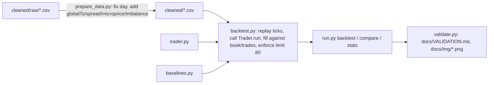

# OpporCode

[](https://github.com/vincal848/imc-prosperity-market-making/actions/workflows/tests.yml)

This project came out of IMC Prosperity 2026 Round 1, a two-product market-making
round (ASH_COATED_OSMIUM and INTARIAN_PEPPER_ROOT, position limit 80). Across
the round I wrote five versions of the trading bot, ending with TraderC1: an
Avellaneda-Stoikov-flavored market maker with an empirically fit half spread
and a vol-shock spread widener.

I have since rebuilt it: fixed a real pricing bug in the strategy (a
truncation-vs-rounding error in the fair-value clamp), fixed a reversed `day`
label in the cleaned data that made Pepper's trend look like three
disconnected sawtooths instead of one continuous line, and built a local
backtester so the strategy's actual numbers are honest rather than assumed.
****The headline finding is not flattering, and it got less flattering once the
comparison was made honest: on INTARIAN_PEPPER_ROOT a correct hold-to-the-limit
baseline earns 239,471 XIRECS over the round versus 10,398 for the symmetric
market maker (the earlier 26,955 baseline only ever held 9 units -- a bug).** A
trend mode that I selected on day 0 only (below) reaches 235,913: it ties the
baseline on day 1 and loses to it on day 2, so **nothing here beats hold-to-limit
on Pepper out of sample.** The market maker still beats a fixed-fair-value
baseline on ASH_COATED_OSMIUM over the round (24,176 vs. 20,986), but loses to it
on day 1 and does not survive a stricter fill model (see Checks).


*Top: Pepper's mid price across all three days once the day labels are fixed -- one continuous
rise from 10,000 to 13,000, not the three-segment sawtooth in the original
`Background_and_Research/PepperGraph.png`. Bottom: the trend is strong enough that just buying
to the limit and holding beats the rebuilt market maker's PnL curve for the whole round.*

## At a glance

| | |
|---|---|
| **Methods** | Avellaneda-Stoikov-style inventory skew, empirical fill-rate-weighted half spread, vol-shock spread widening, short-window drift fair-value shift |
| **Inputs** | `cleaned/*.csv` -- 3 days x 10,000 ticks x 2 products of IMC Prosperity order book snapshots and trades |
| **Outputs** | `trader.py` (submission-ready), per-tick/per-day mark-to-market PnL |
| **Validation** | 35 pytest tests: pricing formulas, skew sign/clamp, state round-trip, position-limit compliance, backtester fill/limit invariants, day-ordering correctness |
| **Headline result** | No edge over honest baselines: hold-to-limit (239,471) beats every Pepper strategy tried out of sample; the Ash MM beats its baseline over the round but not on day 1 or under stricter fills |
| **Stack** | Python 3.13, stdlib only for `trader.py`; pandas/numpy/matplotlib for backtest/analysis |

## Results

Two backtester fixes changed the numbers: the trader now sees the *previous*
tick's trades while resting quotes fill against the *current* tick's (it used
to see and fill against the same prints), and the buy-and-hold baseline now
buys every tick until position 80 (it used to buy once and end at 9 units).
Each has a test that fails without it. Per-day PnL (XIRECS), corrected:

| product | strategy | day 0 | day 1 | day 2 | total |
|---|---|---:|---:|---:|---:|
| ASH_COATED_OSMIUM | original market maker | 8,018 | 8,356 | 7,802 | 24,176 |
| ASH_COATED_OSMIUM | fixed-value MM baseline (10000 +/- 2) | 6,523 | 8,381 | 6,082 | 20,986 |
| INTARIAN_PEPPER_ROOT | original market maker (trend mode off) | 3,020.5 | 4,105.5 | 3,272 | 10,398 |
| INTARIAN_PEPPER_ROOT | hold-to-limit baseline | 79,591 | 79,720 | 80,160 | 239,471 |
| INTARIAN_PEPPER_ROOT | trend mode, day-0 pick (500, 0.5, 0) | 76,099 | 79,720 | 80,094 | 235,913 |

(Before the fixes: original MM 25,262 / 11,076; buy-and-hold 26,955.) Ash is
identical with trend mode on, since it never engages there.

### Walk-forward protocol and out-of-sample result

The protocol is in [`docs/PROTOCOL.md`](docs/PROTOCOL.md) and was committed
before any new strategy ran: tune on **day 0 only**, then score days 1 and 2
once. `python walkforward.py tune` tried **19 variants** (original MM plus
lookback {500, 1000, 2000} x drift t-stat threshold {0.5, 1.0, 1.5} x MM-overlay
band {0, 10}); the day-0 winner was lookback 500, threshold 0.5, overlay 0 (a
+/-80 core with no market making). Day-0 PnL of every variant is in
`python walkforward.py tune`'s output; the overlay variants were uniformly
worse than no overlay.

| out of sample | day 1 | day 2 |
|---|---:|---:|
| Pepper: trend mode (day-0 pick) | 79,720 | 80,094 |
| Pepper: hold-to-limit | 79,720 | 80,160 |
| Ash: market maker | 8,356 | 7,802 |
| Ash: fixed-value baseline | 8,381 | 6,082 |

**Verdict.** On Pepper the trend mode ties on day 1 and is 66 behind on day 2:
it does not beat hold-to-limit, and cannot -- the position is capped at 80, so
the drift is already fully captured by the baseline; the 3,492 shortfall on day 0
is just the lookback warm-up before the trend is detected. On Ash the market
maker wins day 2 by 1,720 but loses day 1 by 25. No edge over the honest
baselines yet.

### Checks (`python checks.py`)

| check | result |
|---|---|
| null: linearly detrended Pepper -> trend mode should not engage | **FAILS.** With threshold 0.5 the trader sits at \|position\| >= 70 on 99% of ticks and ends at -80 (pnl 738). A 0.5 t-stat is not a significance level; the day-0 pick was never null-calibrated. |
| placebo: Pepper mirrored (prices negated) | Passes: goes to -80, earns 235,913 (symmetric), min position -80, no blow-up; hold-to-limit loses 240,511 on the same data. |
| fill stress: passive fills at 50% of printed quantity, strictly-through prints only | Pepper unchanged (the baseline and trend mode cross the book): 75,952 / 79,720 / 80,160 vs. 79,591 / 79,720 / 80,160. **Ash MM falls to 2,221 / 2,330 / 2,244 per day, below the fixed-value baseline's 4,416 / 6,242 / 4,499** -- its edge depends on generous passive fills. |

Next hypothesis: pick the threshold from a signal-free calibration (e.g. the
detrended series' own t-stat distribution, |t| > ~2) rather than from day-0 PnL,
and re-test with a fresh protocol; with 3 days of one trending path this may
not be testable at all. Caveats: one path, three days, one tuning day.

## How it works



`trader.py` is a single-file, stdlib-only Trader: per tick, per product, it
tracks a rolling fair value (last two-sided microprice), a decayed histogram
of `|trade price - fair value|` used to pick the half spread that maximizes
`fillRate(distance) * distance`, a short/long realized-vol ratio used to
detect and widen for vol shocks, and (Pepper only) a short-window drift used
to shift fair value and widen further. Inventory skew follows an
Avellaneda-Stoikov-style form, `position * sigma * sqrt(1 / (fillRate *
horizon))`, clamped to +/-4 ticks.

## Decisions

- Kept TraderC1's strategy intact rather than redesigning it -- the task was
  to rebuild and fix, not to re-invent the strategy. The one behavioral
  change (rounding vs. truncating the fair-value clamp) is narrow and tested.
- `prepare_data.py` treats the already-committed `cleaned/*.csv` as the
  frozen raw source (moved to `cleaned/raw/` via `git mv`) rather than trying
  to reconstruct whatever the original ingestion script read from IMC's raw
  per-day files, which no longer exist in this repo's history.
- The backtester's fill model is a documented simplification (crossing fills
  walk the visible book; passive fills cross against printed trades at our
  own price) since IMC's actual matching engine is not public. See
  `backtest.py`'s module docstring for the exact rules.
- Baselines are deliberately parameter-free: a fixed-value MM for mean-
  reverting Ash, hold-to-the-limit for trending Pepper. The point is to show
  whether the rebuilt strategy's complexity earns its keep against the
  simplest sane alternative for each market's character, not to find the
  single best possible trivial strategy.

## Quick start

```bash
python -m venv .venv
.venv/Scripts/activate    # .venv/bin/activate on Linux/macOS
pip install -r requirements-dev.txt

python prepare_data.py            # generate cleaned/ from cleaned/raw/ (required first; cleaned/*.csv is gitignored)
python run.py stats               # per-day price stats, shows the Pepper trend
python run.py backtest            # rebuilt trader, both products, all days
python run.py compare             # rebuilt trader vs. trivial baseline, both products
pytest tests -q                   # 35 tests
python walkforward.py tune        # all variants on day 0 (prints the variant count)
python walkforward.py test 500 0.5 0   # the day-0 pick on days 0-2
python checks.py                  # null, placebo, fill-stress checks
python validate.py                # regenerate docs/VALIDATION.md and docs/img/*.png
```

## Repository guide

| Path | Contents |
|---|---|
| `trader.py` | The submission-ready bot (stdlib only) |
| `datamodel.py` | Minimal reimplementation of IMC's public `datamodel` interface |
| `backtest.py` | Deterministic local replay/fill engine |
| `baselines.py` | Trivial comparison traders used by `run.py compare` |
| `prepare_data.py` | Regenerates `cleaned/*.csv` from `cleaned/raw/*.csv`, fixing the day order |
| `run.py` | CLI: `backtest`, `stats`, `compare` |
| `validate.py` | Regenerates `docs/VALIDATION.md` and `docs/img/*.png` |
| `cleaned/raw/` | Frozen pre-fix `allPrices.csv`/`allTrades.csv` |
| `cleaned/` | Corrected prices/trades/analysis CSVs (generated by `prepare_data.py`, gitignored) |
| `walkforward.py`, `checks.py` | Day-0 tuning / out-of-sample scoring; null, placebo and fill-stress checks |
| `docs/PROTOCOL.md` | The evaluation protocol, declared before testing new strategies |
| `legacy/` | The four superseded bots plus the original TraderC1.py, annotated |
| `Background_and_Research/` | Pre-rebuild exploratory plots (`AshGraph.png`, `PepperGraph.png`) |
| `docs/BACKGROUND.md` | Full writeup of the day-ordering bug and why it matters |
| `docs/VALIDATION.md` | Generated numbers (see `validate.py`) |
| `tests/` | pytest suite, sentence-named, no network |

## Future interests

- Null-calibrate the regime detector's threshold (a first, day-0-tuned attempt
  is in `trader.py` and fails the null check; see Results).
- Round 2+ products and the actual IMC conversions/observations mechanics,
  which this round didn't exercise (`datamodel.py` includes
  `ConversionObservation` for forward compatibility but nothing here uses it).
- A proper event-driven backtester if IMC ever publishes order-level (not
  just top-3-level aggregated) book data, to drop the passive-fill
  assumption.

## Notes

- Data provenance: all CSVs under `cleaned/` originate from IMC Prosperity
  2026 Round 1's own data export for ASH_COATED_OSMIUM and
  INTARIAN_PEPPER_ROOT; `datamodel.py` mirrors IMC's own (unpublished as a
  package) interface closely enough that `trader.py` is submission-compatible,
  but is not IMC's code.
- `cleaned/*.csv` is derived and gitignored; only `cleaned/raw/` (the sole copy of the original export) is committed.
- Backtest timings are single-core on a Windows machine; a full `run.py
  backtest` (both products, 60,000 ticks total) runs in a few seconds, and
  `run.py compare` (double that, with a second trader) in well under a
  minute.
- The position-limit and fill-model assumptions in `backtest.py` are a
  simplification of IMC's real matching engine, which is not public; see its
  module docstring for the exact rules assumed.
